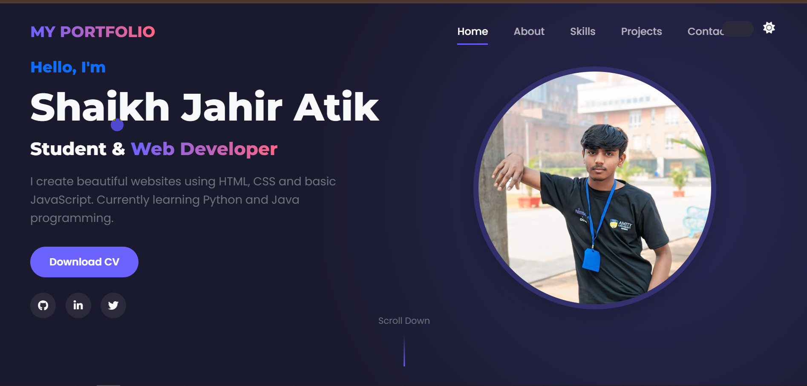

# Shaikh Jahir Atik - Portfolio Website

## 🌟 About

Welcome to my professional portfolio website! This responsive website showcases my skills, projects, and contact information. Built with modern web technologies, it features a clean design with dark/light mode toggle.

## 🚀 Features

- **Responsive Design**: Works on all devices (mobile, tablet, desktop)
- **Dark/Light Mode**: Toggle between color themes
- **Animated Elements**: Smooth animations using GSAP and AOS
- **Project Showcase**: Filterable project gallery
- **Interactive UI**: Custom cursor, hover effects, and smooth scrolling
- **Contact Form**: Easy way to get in touch

## 🛠 Technologies Used

- **Frontend**: HTML5, CSS3, JavaScript
- **Frameworks**: Bootstrap 5
- **Animation Libraries**: GSAP, AOS (Animate On Scroll)
- **Icons**: Font Awesome
- **Fonts**: Google Fonts (Poppins, Montserrat)

## 📂 Project Structure
